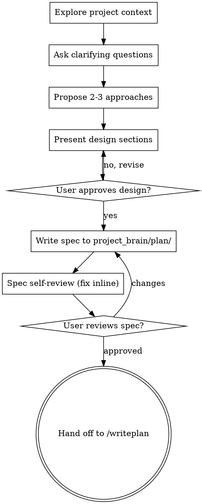

# Brainstorm Ideas Into Designs

Turn an idea into a design through collaborative dialogue. Understand context, ask one question at a time, propose approaches, present the design, land a spec, hand off to `/writeplan`.

<GATE>
Design before code. Do not write code, scaffold, or invoke an implementation skill until you present a design and the user approves it. This holds for every real feature regardless of perceived simplicity.
</GATE>

Run this for real features. Skip it on trivial or mechanical work (rename, config tweak, one-line fix); CLAUDE.md outranks this skill.

## Process Flow

The terminal state is `/writeplan`. It folds the spec's conclusions into Vision/plan so the second brain stays canonical. Invoke no other implementation skill from here.

## The Process

**Understand the idea.** Check current state first (files, docs, recent commits). If the request spans multiple independent subsystems, flag it and decompose into sub-projects before refining details; each sub-project gets its own spec then plan then implementation. For a well-scoped project, ask one question per message, multiple-choice when it fits, focused on purpose, constraints, and success criteria.

**Explore approaches.** Propose 2-3 approaches with trade-offs. Lead with your recommendation and the reason.

**Present the design.** Scale each section to its complexity (a sentence when straightforward, up to ~300 words when nuanced). Confirm after each section. Cover architecture, components, data flow, error handling, testing.

**Design for isolation.** Break the system into units with one clear purpose, well-defined interfaces, independently testable. For each: what it does, how to use it, what it depends on. A consumer should understand a unit without reading its internals, and you should be able to change internals without breaking consumers. A file that grows large signals it is doing too much.

**In existing code.** Follow existing patterns. Fold in targeted improvements where current code blocks the work (oversized file, tangled responsibility). Skip unrelated refactoring.

You may sketch an ASCII mockup inline when a visual clarifies the design.

## After the Design

**Write the spec** to `project_brain/plan/<topic>-design.md`. Spec output lands in `project_brain/plan/`, never `docs/`; this blueprint has no `docs/` folder.

**Spec self-review** with fresh eyes, fix inline:
1. Placeholders: any "TBD", "TODO", or vague requirement.
2. Consistency: sections that contradict, architecture that mismatches features.
3. Scope: focused enough for one plan, or needs decomposition.
4. Ambiguity: any requirement readable two ways; pick one, make it explicit.

For a deeper pass, dispatch a reviewer subagent using `spec-document-reviewer-prompt.md`.

**User review gate.** Ask the user to review the written spec:

> "Spec written to `<path>`. Review it and tell me if you want changes before we write the plan."

Wait. On changes, fix and re-run the self-review. Only proceed once the user approves.

**Hand off to `/writeplan`** to fold the conclusions into Vision/plan. That is the only next step.

## Key Principles

- One question at a time, multiple-choice when it fits.
- YAGNI ruthlessly: cut features the design does not need.
- Always propose 2-3 approaches before settling.
- Present, then get approval before moving on.
- Go back and clarify when something does not fit.
- Verify with fresh evidence before claiming done.
- Dispatch independent work to parallel subagents.
