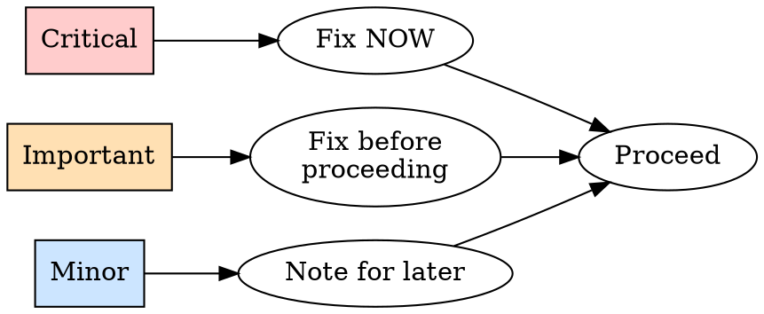

# Code Review

Two halves: REQUESTING (you dispatch a reviewer for finished work) and RECEIVING (you act on feedback handed to you). Same skill because they're two sides of one loop.

---

# REQUESTING

Dispatch a reviewer subagent with context you craft for the work product. Keeps the reviewer on the code and your own context free for the next task.

## When to request

| Mandatory | Valuable |
|-----------|----------|
| After each task in `/execute` | When stuck (fresh eyes) |
| After a major feature | After fixing a complex bug |
| Before merge to main | Before a risky refactor (baseline) |

## How to request

**1. Get the SHAs:**
```bash
BASE_SHA=$(git rev-parse HEAD~1)   # or origin/main
HEAD_SHA=$(git rev-parse HEAD)
```

**2. Dispatch the reviewer.** Use the Task tool (`general-purpose`), filling the template in `code-reviewer.md`. Placeholders:
- `{DESCRIPTION}` - what you built
- `{PLAN_OR_REQUIREMENTS}` - what it should do (the task text, or the plan file under `project_brain/plan/`)
- `{BASE_SHA}` / `{HEAD_SHA}` - the range

**3. Act on feedback by severity:**



Reviewer wrong? Push back with technical reasoning (see RECEIVING). Then record the outcome with `/done`.

## Example

```
[Finished a task: added verifyIndex() + repairIndex()]

BASE_SHA=$(git rev-parse HEAD~1); HEAD_SHA=$(git rev-parse HEAD)
[Dispatch reviewer]
  DESCRIPTION: verifyIndex() and repairIndex(), 4 issue types
  PLAN_OR_REQUIREMENTS: project_brain/plan/plan_summary, task 2
  BASE_SHA / HEAD_SHA

[Returns] Important: missing progress indicators. Minor: magic number 100.
  Assessment: ready with fixes.

→ Fix progress indicators (Important, before proceeding), note the magic number.
→ /done, then next task.
```

See template: `code-reviewer.md`

---

# RECEIVING

Code review is technical evaluation. Judge each item on the merits.

**Core principle:** Verify before implementing. Ask before assuming. Technical correctness over social comfort.

## Two safety gates

```
GATE 1 - No gratitude, no performative agreement.
  Banned: "You're absolutely right", "Great point", "Thanks for catching that",
  any thanks, any praise of the feedback.
  Instead: state the fix, or just fix it. The code shows you heard.

GATE 2 - Verify before you implement.
  A suggestion is a claim to check against THIS codebase.
  Confirm it's correct here before touching code.
```

About to write "Thanks"? Delete it, state the fix.

## Response pattern

```
1. READ    full feedback, no reacting
2. VERIFY   check each item against codebase reality (GATE 2)
3. EVALUATE technically sound for THIS stack?
4. RESPOND  technical acknowledgment or reasoned pushback (GATE 1)
5. IMPLEMENT one item at a time, test each
```

## Unclear feedback: stop and ask

```
IF any item is unclear:
  STOP. Implement nothing yet.
  ASK for clarification on the unclear items first.
WHY: items relate. Partial understanding produces wrong implementation.
```

Example: told "fix 1-6", clear on 1,2,3,6, unclear on 4,5 → "Clear on 1,2,3,6. Need clarification on 4 and 5 before implementing." (not: do four now, ask later).

## Verify before implementing (external reviewers)

```
BEFORE implementing a suggestion, check:
  - Correct for THIS codebase / stack?
  - Breaks existing functionality?
  - Reason the current code is the way it is (legacy/compat)?
  - Does the reviewer have full context?

IF it looks wrong       → push back with technical reasoning
IF you can't verify     → say so: "Can't verify without [X]. Investigate / ask / proceed?"
IF it conflicts with a settled decision → stop, discuss with the user first
```

Human partner's feedback is trusted: implement after understanding, still ask if scope is unclear.

## YAGNI check on "professional" features

```
Reviewer says "implement this properly":
  grep the codebase for actual usage.
  Unused → "Nothing calls this. Remove it (YAGNI)?"
  Used   → implement properly.
```

## Push back when

The suggestion breaks something, the reviewer lacks context, it violates YAGNI, it's wrong for this stack, legacy/compat needs it, or it conflicts with a settled architectural decision.

**How:** technical reasoning over defensiveness, specific questions, reference the working test/code, involve the user if it's architectural.

**Wrong after pushing back?** State it factually and move on: "You were right, checked [X], it does [Y]. Implementing." No long apology, no defending the pushback.

## GitHub thread replies

Reply inside the comment thread (`gh api repos/{owner}/{repo}/pulls/{pr}/comments/{id}/replies`), not as a top-level PR comment.

## Quick reference

| Situation | Do |
|-----------|-----|
| Feedback is correct | "Fixed. [what changed]" or just fix it |
| Feedback unclear | Stop, clarify all items first |
| Suggestion looks wrong | Push back with technical reasoning |
| Can't verify | State the limitation, ask for direction |
| "Implement properly" | grep usage, YAGNI if unused |
| Multi-item feedback | Clarify first, then blocking → simple → complex, test each |
| Caught writing "Thanks" | Delete it, state the fix |
