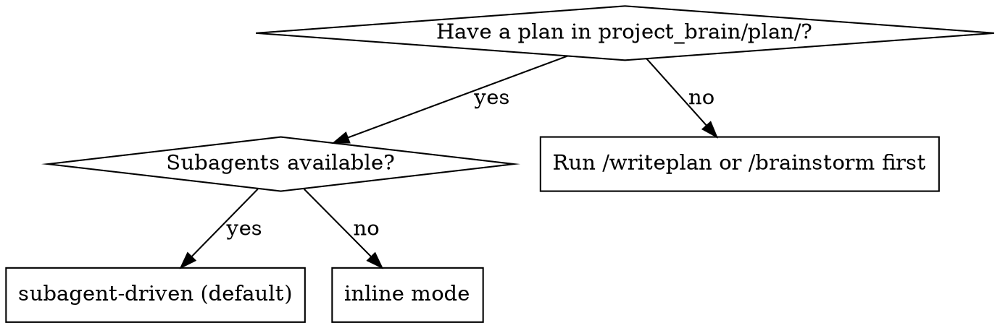
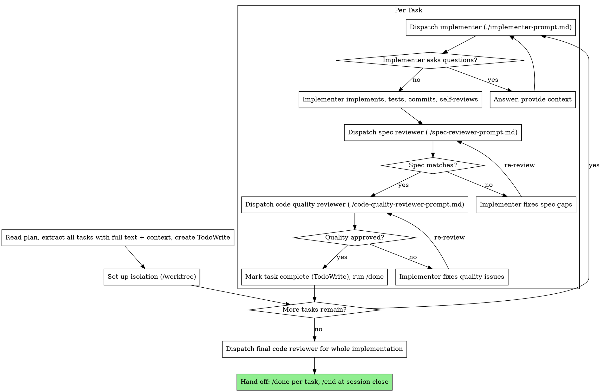

Execute the plan in `project_brain/plan/`. Default to subagent-driven: dispatch a fresh subagent per task, two-stage review after each. Use inline mode only when subagents are unavailable.

## Iron Laws

- Never start implementation on `main`/`master` without explicit consent. Set up isolation first (`/worktree`).
- One implementer subagent at a time. Parallel implementers conflict.
- Spec review passes (✅) before code-quality review starts. Wrong order otherwise.
- A reviewer that found issues means the task is not done. Implementer fixes, reviewer re-reviews, repeat until ✅.
- Verify with fresh evidence before claiming done (CLAUDE.md rule 4).
- Run all tasks continuously. Stop only for BLOCKED you can't resolve, genuine ambiguity, or completion. No "should I continue?" check-ins.

## Pick the mode



Subagent-driven keeps your context clean (fresh subagent per task), runs review checkpoints automatically, and iterates without waiting on a human. Inline mode runs the tasks in this session for a separate-session handoff with manual checkpoints.

---

## Subagent-driven mode (default)

Delegate each task to a fresh subagent with exactly the context it needs. Never let it inherit your session history; construct its prompt from the plan text. This preserves your context for coordination.



### Prompt templates (load when you dispatch)

- `./implementer-prompt.md`: implementer subagent
- `./spec-reviewer-prompt.md`: spec compliance reviewer
- `./code-quality-reviewer-prompt.md`: code quality reviewer

### Model selection

Use the least powerful model that handles each role, to conserve cost and speed up iteration.

| Task signal | Model |
|---|---|
| 1-2 files, complete spec, mechanical | cheap/fast |
| Multiple files, integration concerns | standard |
| Design judgment or broad codebase understanding | most capable |
| Review tasks (spec + quality) | most capable |

### Handling implementer status

The implementer reports one of four statuses.

| Status | Action |
|---|---|
| **DONE** | Proceed to spec review. |
| **DONE_WITH_CONCERNS** | Read the concerns. Correctness/scope concerns: address before review. Observations (e.g. "file getting large"): note and proceed. |
| **NEEDS_CONTEXT** | Provide the missing context, re-dispatch. |
| **BLOCKED** | Diagnose, then change something: context problem → add context, same model; needs more reasoning → re-dispatch on a more capable model; task too large → split it; plan is wrong → escalate to the user. |

Never ignore an escalation or retry the same model unchanged. If the implementer is stuck, something has to change.

---

## Inline mode (no subagents)

Run the plan in this session, with manual review checkpoints. Use for a separate-session handoff where the executor reviews the plan critically before starting.

1. Read the plan in `project_brain/plan/`. Review it critically; raise concerns with the user before starting.
2. `/worktree` for isolation if not already isolated.
3. Create TodoWrite from the tasks. For each: mark in_progress, follow the steps exactly, run the verifications, mark complete, run `/done`.
4. After all tasks pass, run `/critique` over the whole implementation.
5. Stop and ask on any blocker (missing dependency, failing verification, unclear instruction). Don't force through; don't guess.

---

## Compose with

- `/writeplan` produces the plan this skill executes (`project_brain/plan/`).
- `/worktree` ensures the isolated workspace before implementation.
- `/tdd` is how each implementer subagent writes code; `/diagnose` when a verification fails.
- `/critique` is the reviewer template for the spec and quality checkpoints.
- Finish: `/done` per task (log, prune roadmap, set next step), `/end` at session close (safety-net sweep).
- Dispatch independent work to parallel subagents (CLAUDE.md rule 2); implementers stay sequential.

## One example (subagent-driven)

```
[Read project_brain/plan/, extract 5 tasks, TodoWrite]

Task 2: Recovery modes
[Dispatch implementer with full task text + context]
Implementer: added verify/repair modes, 8/8 tests pass, committed. Status: DONE

[Dispatch spec reviewer]
Spec reviewer: ❌ missing progress reporting; extra --json flag (not requested)
[Implementer fixes] → Spec reviewer: ✅

[Dispatch code quality reviewer]
Code reviewer: Issue (Important): magic number 100
[Implementer extracts PROGRESS_INTERVAL] → Code reviewer: ✅

[Mark complete, /done] → next task
```
