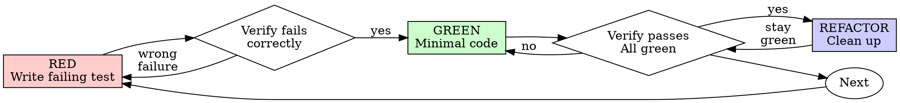

# Test-Driven Development (/tdd)

Write the test first. Watch it fail. Write minimal code to pass.

**Core principle:** If you didn't watch the test fail, you don't know if it tests the right thing. Violating the letter violates the spirit.

## When to Use

Always: new features, bug fixes, refactoring, behavior changes.

Ask the user before skipping: throwaway prototypes, generated code, config files.

## The Iron Law

```
NO PRODUCTION CODE WITHOUT A FAILING TEST FIRST
```

Wrote code before the test? Delete it and start over. Don't keep it as reference, don't adapt it, don't look at it. Implement fresh from tests.

## Red-Green-Refactor



### RED - Write Failing Test

Write one minimal test showing what should happen. One behavior, clear name, real code (mocks only if unavoidable).

```typescript
test('retries failed operations 3 times', async () => {
  let attempts = 0;
  const operation = () => {
    attempts++;
    if (attempts < 3) throw new Error('fail');
    return 'success';
  };

  const result = await retryOperation(operation);

  expect(result).toBe('success');
  expect(attempts).toBe(3);
});
```

### Verify RED - Watch It Fail

**MANDATORY gate. Never skip.**

```bash
npm test path/to/test.test.ts
```

Confirm: test fails (not errors), failure message is expected, fails because the feature is missing (not a typo).

- Test passes? You're testing existing behavior. Fix the test.
- Test errors? Fix the error, re-run until it fails correctly.

### GREEN - Minimal Code

Write the simplest code that passes the test. No extra features, no refactoring other code, no improving beyond the test (YAGNI).

```typescript
async function retryOperation<T>(fn: () => Promise<T>): Promise<T> {
  for (let i = 0; i < 3; i++) {
    try {
      return await fn();
    } catch (e) {
      if (i === 2) throw e;
    }
  }
  throw new Error('unreachable');
}
```

### Verify GREEN - Watch It Pass

**MANDATORY gate.**

```bash
npm test path/to/test.test.ts
```

Confirm: test passes, other tests still pass, output pristine (no errors, warnings).

- Test fails? Fix the code; leave the test alone.
- Other tests fail? Fix them now.

### REFACTOR - Clean Up

After green only: remove duplication, improve names, extract helpers. Keep tests green, add no behavior.

### Repeat

Next failing test for the next feature.

## Good Tests

| Quality | Good | Bad |
|---------|------|-----|
| **Minimal** | One thing. "and" in name? Split it. | `test('validates email and domain and whitespace')` |
| **Clear** | Name describes behavior | `test('test1')` |
| **Shows intent** | Demonstrates desired API | Obscures what code should do |

## Verification Checklist

Before marking work complete:

- [ ] Every new function/method has a test
- [ ] Watched each test fail before implementing
- [ ] Each test failed for the expected reason (feature missing, not typo)
- [ ] Wrote minimal code to pass each test
- [ ] All tests pass
- [ ] Output pristine (no errors, warnings)
- [ ] Tests use real code (mocks only if unavoidable)
- [ ] Edge cases and errors covered

Can't check all boxes? You skipped TDD. Start over.

## When Stuck

| Problem | Solution |
|---------|----------|
| Don't know how to test | Write the wished-for API, write the assertion first, ask the user. |
| Test too complicated | Design too complicated. Simplify the interface. |
| Must mock everything | Code too coupled. Use dependency injection. |
| Test setup huge | Extract helpers. Still complex? Simplify the design. |

When adding mocks or test utilities, read `testing-anti-patterns.md` to avoid testing mock behavior, test-only production methods, and mocking without understanding dependencies.

## Red Flags

Code before test, test passing immediately, can't explain the failure, tests added later, or any "just this once" rationalization means: delete the code, start over with TDD.

## Debugging Integration

Bug found? Write a failing test reproducing it, then follow the cycle; the test proves the fix and prevents regression. For a stubborn bug, run `/diagnose`. Never fix bugs without a test.
