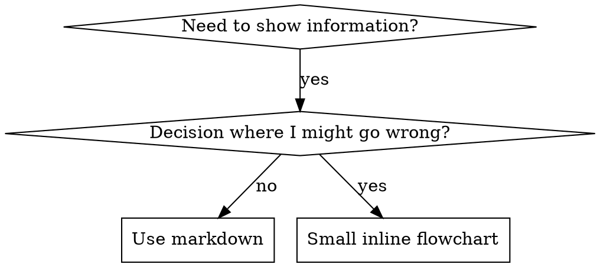

# Writing Skills

Writing a skill IS `/tdd` applied to process documentation. Write the test (pressure scenario with a subagent), watch it fail (baseline behavior with no skill), write the skill, watch it pass, refactor to close loopholes.

**Core principle:** if you never watched an agent fail without the skill, you don't know the skill teaches the right thing.

## The Iron Law

```
NO SKILL WITHOUT A FAILING TEST FIRST
```

Applies to new skills AND edits. Wrote the skill before testing? Delete it, start over. Same for an untested edit. Violating the letter of the rule violates the spirit. No exceptions for "simple addition", "just a section", "doc update". Delete means delete: don't keep it as reference, don't adapt it while testing.

## When to create one

Create when the technique wasn't obvious, you'd reuse it across projects, and the pattern is broad. Skip one-offs, well-documented standard practice, and project conventions (those go in CLAUDE.md). If a rule is enforceable with regex/validation, automate it instead; save skills for judgment calls.

A skill is a reusable technique, pattern, or reference guide. It is not a narrative about how you solved something once.

## RED-GREEN-REFACTOR for skills

- **RED:** run a pressure scenario with a subagent, no skill present. Record the exact choices and rationalizations (verbatim) and which pressures triggered them.
- **GREEN:** write the minimal skill that answers those specific rationalizations. Re-run the same scenarios. The agent should comply.
- **REFACTOR:** new rationalization appears, add an explicit counter. Re-test until bulletproof.

Full method (pressure types, plugging holes, meta-testing): see `testing-skills-with-subagents.md`.

## SKILL.md structure

Required frontmatter, max 1024 chars:
- `name`: letters, numbers, hyphens only. Match the folder/slug.
- `description`: third person, one trigger-based sentence. Says ONLY when to use, never what the skill does.
- `when_to_use`: trigger phrases plus when the AI should auto-fire it.

Body sections, in order: Overview (core principle in 1-2 sentences), When to use (symptoms plus when NOT to), Core pattern (before/after for techniques), Quick reference (scannable table), Implementation (inline for simple, pointer to a file for heavy reference), Common mistakes.

## Claude Search Optimization

Future Claude has to FIND the skill. Optimize discovery.

**Description = when to use, not what it does.** A description that summarizes the workflow becomes a shortcut Claude follows instead of reading the body. One that names only triggers makes Claude open the skill and follow the real steps.

```yaml
# BAD: summarizes workflow, Claude follows this and skips the body
description: Use when executing plans, dispatches a subagent per task with review between tasks

# GOOD: triggers only, Claude reads the body
description: Use when executing implementation plans with independent tasks
```

Describe the *problem* (race condition, inconsistent behavior), not language-specific symptoms (setTimeout, sleep). Keep triggers technology-agnostic unless the skill itself is technology-specific, then say so explicitly. Third person, it's injected into the system prompt.

**Keyword coverage:** use the words Claude would search: error strings ("ENOTEMPTY", "race condition"), symptoms ("flaky", "hanging", "pollution"), synonyms ("timeout/hang/freeze"), real commands and library names.

**Descriptive naming:** active, verb-first, named by what you DO or the core insight.
- `condition-based-waiting` over `async-test-helpers`
- `root-cause-tracing` over `debugging-techniques`
- gerunds work for processes: `creating-skills`, `testing-skills`

**Token efficiency:** frequently-loaded skills cost tokens every conversation. Target under 200 words for those, under 500 otherwise. Move flag details to `--help`, cross-reference instead of repeating, compress examples, cut redundancy. Verify with `wc -w SKILL.md`.

## File organization

Keep inline: principles, concepts, code under ~50 lines. Split into a separate file for heavy reference (100+ lines of API/syntax) or a reusable tool/script/template.

```
skill-name/
  SKILL.md           # required, the main reference
  supporting-file.*  # only when heavy reference or a reusable tool
```

## Cross-referencing other skills

Name the skill with an explicit requirement marker. Never use `@` links, they force-load the file and burn context before you need it.
- Good: `**REQUIRED:** Use /tdd` / `**BACKGROUND:** understand /diagnose`
- Bad: `@skills/.../SKILL.md`

## Flowcharts



Use a flowchart ONLY for non-obvious decision points, loops where you might stop early, and "A vs B" choices. Use markdown for reference material (tables/lists), code examples (code blocks), and linear instructions (numbered lists). Style rules: see `graphviz-conventions.dot`.

## Code examples

One excellent example beats many mediocre ones. Pick the most relevant language; make it complete, runnable, commented with WHY, and ready to adapt. Skip multi-language duplicates, fill-in-the-blank templates, and contrived cases. You port well, one great example is enough.

## Bulletproofing discipline skills

Discipline skills (rules under pressure) need to resist rationalization. Close each loophole explicitly: state the rule, then forbid the specific workarounds ("don't keep it as reference, don't adapt it, delete means delete"). Add the foundational line early: **violating the letter is violating the spirit**. Build a rationalization table from baseline testing (every excuse the agent made, paired with its reality) and a tight red-flags line so the agent can self-check.

## Skill creation checklist

Track each item with TodoWrite.

**RED:** build pressure scenarios (3+ combined pressures for discipline skills); run them with no skill; record baseline rationalizations verbatim; find the pattern.

**GREEN:** name is hyphen-only and matches the slug; frontmatter has `name`, `description`, `when_to_use` (under 1024 chars); description starts with a trigger and summarizes no workflow; keywords seeded throughout; clear overview with the core principle; the body answers the specific baseline failures; code inline or pointed to a file; one strong example; re-run scenarios with the skill and confirm compliance.

**REFACTOR:** catch new rationalizations; add explicit counters; build the rationalization table and red-flags line; re-test until bulletproof.

**Quality:** flowchart only when the decision is non-obvious; quick-reference table; common-mistakes section; no narrative storytelling; supporting files only for tools or heavy reference.

**Deploy:** verify with fresh evidence before claiming done; commit the skill. One skill at a time, verify each before the next. Deploying an untested skill is deploying untested code.
