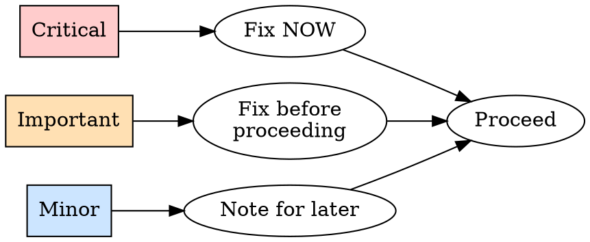

# Review

Two halves: REQUESTING (you dispatch a reviewer for finished work) and RECEIVING (you act on feedback handed to you). Same skill, two sides of one loop.

---

# REQUESTING

Dispatch a reviewer subagent with the context you craft for the deliverable. Keeps the reviewer on the work and your own context free for the next task.

## When to request

| Mandatory | Valuable |
|-----------|----------|
| After each task in `/execute` | When stuck (fresh eyes) |
| After a major deliverable | After a heavy revision |
| Before you finalize or share | Before a big restructure (baseline) |

## How to request

1. **Point at the work.** The deliverable file(s) in the vault (or the section you changed), plus what it should achieve: the task text, the brief, or the plan file under `project_brain/plan/`.
2. **Dispatch the reviewer.** Use the Task tool (`general-purpose`), filling the template in `reviewer.md`. Placeholders:
   - `{DESCRIPTION}` — what you produced
   - `{REQUIREMENTS}` — what it should achieve (the brief, task text, or plan file)
   - `{TARGET}` — the deliverable file path(s) to review
3. **Act on feedback by severity:**



Reviewer wrong? Push back with reasoning (see RECEIVING). Then record the outcome with `/done`.

## Example

```
[Finished a task: drafted the Q3 strategy brief]

[Dispatch reviewer]
  DESCRIPTION: Q3 strategy brief, 3 recommendations with supporting data
  REQUIREMENTS: project_brain/plan/plan_summary, task 2
  TARGET: Q3-strategy-brief.md

[Returns] Important: recommendation 2 lacks supporting data. Minor: define "ICP" on first use.
  Assessment: ready with fixes.

→ Add the data (Important, before proceeding), define the term.
→ /done, then next task.
```

See template: `reviewer.md`

---

# RECEIVING

A review is a technical evaluation. Judge each item on the merits.

**Core principle:** Verify before acting. Ask before assuming. Correctness over social comfort.

## Two safety gates

```
GATE 1 - No gratitude, no performative agreement.
  Banned: "You're absolutely right", "Great point", "Thanks for catching that",
  any thanks, any praise of the feedback.
  Instead: state the fix, or just fix it. The revised work shows you heard.

GATE 2 - Verify before you act.
  A suggestion is a claim to check against THIS work.
  Confirm it's correct here before changing anything.
```

About to write "Thanks"? Delete it, state the fix.

## Response pattern

```
1. READ     full feedback, no reacting
2. VERIFY   check each item against the work as it actually is (GATE 2)
3. EVALUATE sound for THIS deliverable and audience?
4. RESPOND  technical acknowledgment or reasoned pushback (GATE 1)
5. APPLY    one item at a time
```

## Unclear feedback: stop and ask

```
IF any item is unclear:
  STOP. Change nothing yet.
  ASK for clarification on the unclear items first.
WHY: items relate. Partial understanding produces the wrong revision.
```

Example: told "fix 1-6", clear on 1,2,3,6, unclear on 4,5 → "Clear on 1,2,3,6. Need clarification on 4 and 5 before applying." (not: do four now, ask later).

## Verify before applying (outside feedback)

```
BEFORE applying a suggestion, check:
  - Right for THIS deliverable and its audience?
  - Breaks something that already works?
  - Reason the current version is the way it is (a constraint, a prior decision)?
  - Does the reviewer have full context?

IF it looks wrong       → push back with reasoning
IF you can't verify     → say so: "Can't verify without [X]. Investigate / ask / proceed?"
IF it conflicts with a settled decision → stop, discuss with the user first
```

The user's own feedback is trusted: apply after understanding, still ask if scope is unclear.

## YAGNI check on "do it properly"

```
Reviewer says "flesh this out / do it properly":
  check whether anything actually needs it.
  Nothing depends on it → "Nothing needs this. Leave it out?"
  Something does        → do it properly.
```

## Push back when

The suggestion breaks something, the reviewer lacks context, it adds work nothing needs, it's wrong for this audience, a constraint requires the current form, or it conflicts with a settled decision.

**How:** reasoning over defensiveness, specific questions, point at the part that works, involve the user if it's a direction call.

**Wrong after pushing back?** State it factually and move on: "You were right, checked [X], it does [Y]. Applying." No long apology, no defending the pushback.

## Quick reference

| Situation | Do |
|-----------|-----|
| Feedback is correct | "Fixed. [what changed]" or just fix it |
| Feedback unclear | Stop, clarify all items first |
| Suggestion looks wrong | Push back with reasoning |
| Can't verify | State the limitation, ask for direction |
| "Do it properly" | Check if anything needs it; leave out if not |
| Multi-item feedback | Clarify first, then blocking → simple → complex |
| Caught writing "Thanks" | Delete it, state the fix |
