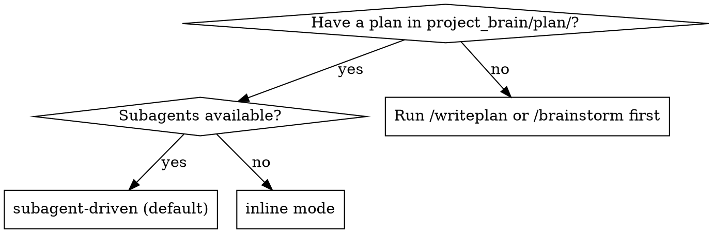
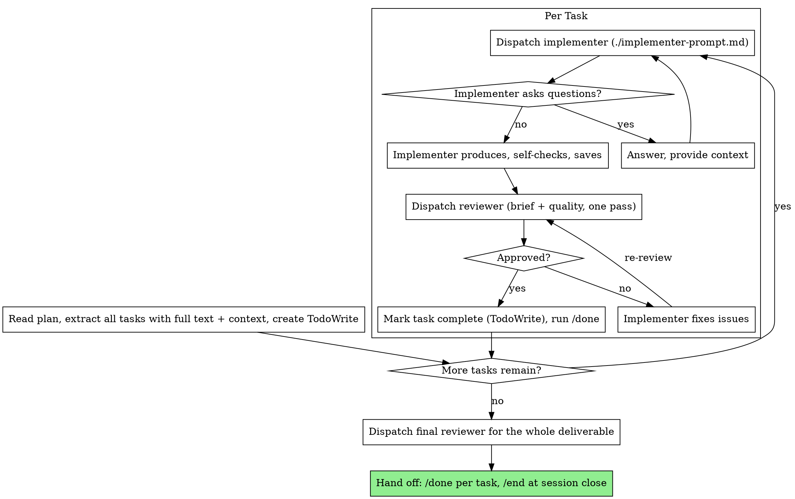

Execute the plan in `project_brain/plan/`. Default to subagent-driven: dispatch a fresh subagent per task, one review after each. Use inline mode only when subagents are unavailable.

## Iron Laws

- One implementer subagent per piece of work. Two implementers on the same file conflict; independent deliverables (different files) can run in parallel.
- Every task gets a review before it's done. A reviewer that found issues means the task is not done: implementer fixes, reviewer re-reviews, repeat until ✅.
- Verify with fresh evidence before claiming done (CLAUDE.md rule 4).
- Run all tasks continuously. Stop only for a blocker you can't resolve, genuine ambiguity, or completion. No "should I continue?" check-ins.

## Review depth

One review per task **by default**: a single reviewer that checks both that the work matches the brief and that it's good (the `/critique` reviewer template, with the task/brief/plan as the requirements). Split into **two passes only for a large or high-stakes deliverable**: brief-match first (`spec-reviewer-prompt.md`), then quality (`quality-reviewer-prompt.md`). Don't pay for two passes on routine work.

## Pick the mode



Subagent-driven keeps your context clean (fresh subagent per task), runs the review checkpoint automatically, and iterates without waiting on a human. Inline mode runs the tasks in this session with manual checkpoints.

---

## Subagent-driven mode (default)

Delegate each task to a fresh subagent with exactly the context it needs. Never let it inherit your session history; construct its prompt from the plan text. This preserves your context for coordination.



### Prompt templates (load when you dispatch)

- `./implementer-prompt.md`: implementer subagent.
- Default review: the `/critique` reviewer template (`reviewer.md`), pointed at the task/brief/plan as the requirements, checking brief-match and quality in one pass.
- High-stakes only: `./spec-reviewer-prompt.md` (brief-match), then `./quality-reviewer-prompt.md` (quality), as a two-pass deep review.

### Model selection

Use the least powerful model that handles each role, to conserve cost and speed up iteration.

| Task signal | Model |
|---|---|
| Small, fully specified, mechanical | cheap/fast |
| Several pieces, some judgment | standard |
| Real judgment or broad understanding of the material | most capable |
| Review task | most capable |

### Handling implementer status

The implementer reports one of four statuses.

| Status | Action |
|---|---|
| **DONE** | Proceed to review. |
| **DONE_WITH_CONCERNS** | Read the concerns. Correctness/scope concerns: address before review. Observations (e.g. "this section is getting long"): note and proceed. |
| **NEEDS_CONTEXT** | Provide the missing context, re-dispatch. |
| **BLOCKED** | Diagnose, then change something: context problem → add context, same model; needs more reasoning → re-dispatch on a more capable model; task too large → split it; plan is wrong → escalate to the user. |

Never ignore an escalation or retry the same model unchanged. If the implementer is stuck, something has to change.

---

## Inline mode (no subagents)

Run the plan in this session, with manual review checkpoints.

1. Read the plan in `project_brain/plan/`. Review it critically; raise concerns with the user before starting.
2. Create TodoWrite from the tasks. For each: mark in_progress, follow the steps exactly, run the checks, mark complete, run `/done`.
3. After all tasks pass, run `/critique` over the whole deliverable.
4. Stop and ask on any blocker (missing input, failed check, unclear instruction). Don't force through; don't guess.

---

## Compose with

- `/writeplan` produces the plan this skill executes (`project_brain/plan/`).
- `/draft` is how each implementer subagent produces a written deliverable; `/diagnose` when a check fails.
- `/critique` is the reviewer for the per-task checkpoint (its `reviewer.md` is the default single pass); the deeper two-pass prompts (`spec-reviewer-prompt.md`, `quality-reviewer-prompt.md`) live in this skill, for high-stakes work.
- Finish: `/done` per task (log, prune roadmap, set next step), `/end` at session close (safety-net sweep).
- Dispatch independent work to parallel subagents (CLAUDE.md rule 2).

## One example (subagent-driven)

```
[Read project_brain/plan/, extract 5 tasks, TodoWrite]

Task 2: Competitor section
[Dispatch implementer with full task text + context]
Implementer: drafted the competitor section, 4 named competitors with sources, self-checked. Status: DONE

[Dispatch reviewer — brief + quality, one pass]
Reviewer: ❌ missing the pricing comparison the brief asked for; claim about market share has no source
[Implementer fixes both] → Reviewer: ✅

[Mark complete, /done] → next task
```
